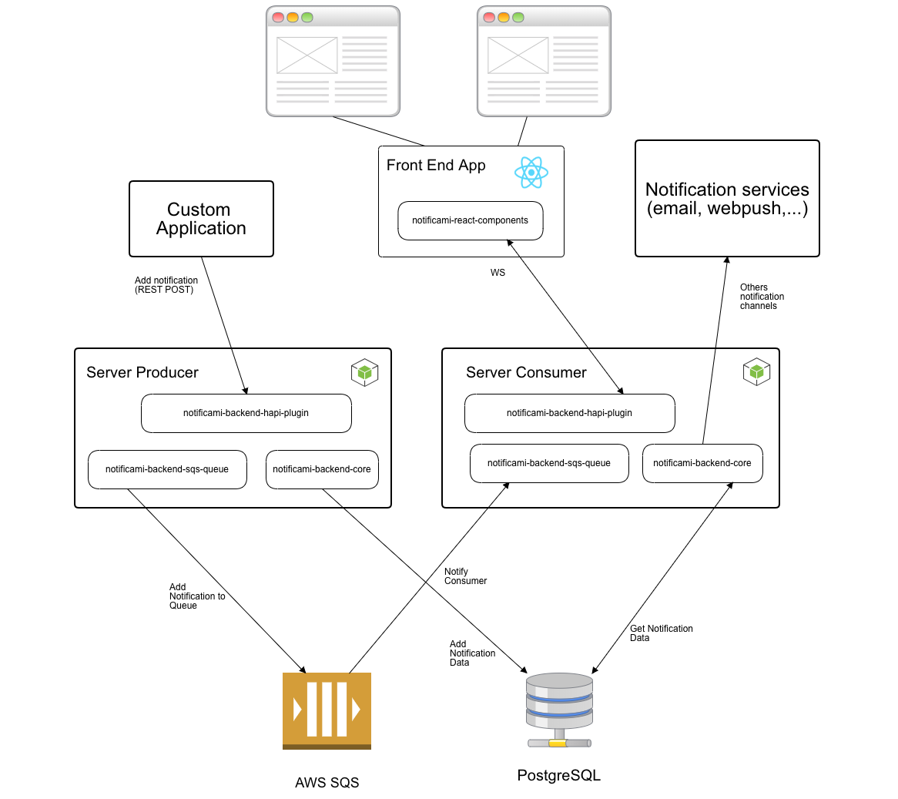

# Notificami - open source notification system

Notificami is a notifications system that aims to send notifications through a very broad range of mediums. The idea behind this project is to provided a simple way of sending notifications and configure their delivery.

The system is built with a plugin model in mind. You can define which storage to use (default is postgres), which notification "channels" you want to use and install your own plugin to make the notification system work with AWS, Azure or GCloud.

## Background

If our applications have authenticated users, we all have some notifications to send (i.e. registration emails). Sometimes we want to also sent push notifications, SMS or messages through websockets. In those cases we need to build our own solutions.

Notificami allows you to reach a wide range of notification services (emails, SMS, webpush, websockets, etc...) with minimal configuration and at the same time gives you the ability to add your own logic into it.

## CORE CONCEPTS

You can use Nofiticami in different ways:

- use `@nearform/notificami-server`
- use the Hapi plugin in your own server

In both cases you can customize the configuration of the server/plugin as you wish adding your own storage system and plugins for sending notifications.

The plugin system is the Hapijs plugin system, so you can actually install other routes if you need to and change as much as you want of the server. (Remember though: with great power comes great repsonsibility!)

The base block of all this is the `NotificationsService` class.

This class provides the following API (an in-depth explanation is given [here](https://github.com/nearform/notificami/tree/master/packages/notificami-backend-core#notification-service))

```javascript
class NotificationsService extends EventEmitter {
  // Main functions
  register(channel, name, handler) {}

  async send(notification, strategy) {}

  get config() {}

  // Proxy methods to the storage service
  async add({ notify, sendStrategy, userIdentifier }) {}

  async getByUserIdentifier(userIdentifier, offsetId, limit) {}

  async hasMoreByUserIdentifier(userIdentifier, offsetId) {}

  async get(id) {}

  async setRead({ id }) {}

  async setUnread({ id }) {}

  async delete({ id }) {}

  async sentBy({ id, channel }) {}

  async close() {}
}
```

As you can see `NotificationsService` is an event emitter. The events it emits are:

- `add`: when a notification as been successfully stored
- `read`: when a notification is marked as read
- `unread`: when a notification is marked as unread
- `delete`: when a notification is deleted
- `sent_by`: when a notification is confirmed to have been sent by a certain

The notification service will also proxy all the storage interface functions.

An instance of this class will be provided by the `server` object (`server.notificationsService`) and you can use it to register your own notification channels (more info [here](#)) or manage notifications (sending, marking as read/unread).

To build an instance of `NotificationsService` a `storage` object is needed. `storage` needs to have the following API:

```
{
  async close() {}

  async add({ notify, sendStrategy, userIdentifier }) {}

  async getByUserIdentifier(userIdentifier, offsetId, limit) {}

  async hasMoreByUserIdentifier(userIdentifier, offsetId, limit) {}

  async get(id) {}

  async setRead({ id }) {}

  async delete({ id }) {}

  async sentBy({ id, channel }) {}
}
```

If you choose to add your own storage method, remember the above functions need to be exposed. Moreover, we assume your own storage will be found in `server.storageService`.

## Architecture
The platform can be used with a single server that acts as a producer consumer or in a more structured way separating the producer and the consumer and using an external queue service to manage the events.

***The single server architecture***


***The multiple server architecture***



## REST API

|Path|Method|Summary|
|----|------|-------|
|`/users/{username}/notifications/{offsetId?}`|GET|List notifications for a specific user|
|`/notifications`|POST|Publish a new notification|
|`/notifications/{id}/read`|PUT|Set notification as read|
|`/notifications/{id}/unread`|PUT|Set notification as unread|
|`/notifications/{id}`|DELETE|Delete notification|

an in-depth explanation is given [here](https://github.com/nearform/notificami/tree/master/packages/notificami-backend-hapi-plugin#api)

## NEXT STEPS

...

## Technical references

- [@nearform/notificami-backend-core](https://github.com/nearform/notificami/tree/master/packages/notificami-backend-core)
- [@nearform/notificami-backend-hapi-plugin](https://github.com/nearform/notificami/tree/master/packages/notificami-backend-hapi-plugin)
- [@nearform/notificami-server](https://github.com/nearform/notificami/tree/master/packages/notificami-server)
- [@nearform/notificami-local-queue](https://github.com/nearform/notificami/tree/master/packages/notificami-local-queue)
- [@nearform/notificami-channel-websocket-nes](https://github.com/nearform/notificami/tree/master/packages/notificami-channel-websocket-nes)
- [@nearform/notificami-sqs-queue](https://github.com/nearform/notificami/tree/master/packages/notificami-sqs-queue)
- [@nearform/notificami-storage-dynamodb](https://github.com/nearform/notificami/tree/master/packages/notificami-storage-dynamodb)
- [@nearform/notificami-react-components](https://github.com/nearform/notificami/tree/master/packages/notificami-react-components)
