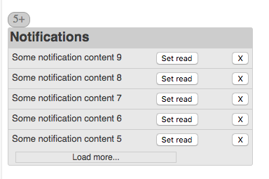

# notifications-react-component

`notifications-react-component` is a ready to use React component that allow to add a notification widget in your page.

It uses the [notifications-server] package as backend.

The Components created use the new React Context API (> 16).

## Quick start

To explore components, use storybook:

```
npm install
npm run storybook
```

and then open the browser at: [http://localhost:6006/](http://localhost:6006/)

## Notificami Widget
The `notificami` widget adds a clickable Badge with the numbers of notifications for the user. Clicking the Badge the notifications list is shown.



### Add to a page
The widget should be embedded in the `NotificamiProvider` that manage the connection with the server and pass the context to the widget.

```
import { WebsocketService, buildWebsocketClient, NotificamiProvider, NotificamiWidget } from 'notifications-react-component'

const client = buildWebsocketClient('ws://127.0.0.1:8482')
client.connect()

class SamplePage extends React.Component {
  render() {
    return (
      <NotificamiProvider userIdentifier='davide' service={WebsocketService(client)}>
        <div id='toolbar'>
          <NotificamiWidget />
        </div>
      </NotificamiProvider>
    )
  }
}
```

### Customize the widget
To customize the widget you can set the classes in the css.

* notifications-box - The classe of the rounded box with the number of notifications
* notifications-list - The classe of the list containing the notifications

A sample can be found in the file [assets/styles.css](./assets/styles.css)

It's possible to change the content of the single notification and pass a component to the Provider to replace the DefaultComponent

```
class NotificationItem extends React.Component {
  renderMessage(notification) {
    if (notification.notify.type === 'mention') {
      return 'You have been mentioned in a comment'
    }

    return 'New comment in discussion...'
  }

  render() {
    return (
      <div className={notificationsItemClass}>
        <span>{this.renderMessage(this.props.notification)}</span>
        <div className={contentClass}>{this.props.notification.notify.comment.content}</div>
        {this.props.notification.notify.url && <a href={this.props.notification.notify.url}>Go see it...</a>}
        <button onClick={this.props.onRemove}>X</button>
      </div>
    )
  }
}

class SamplePage extends React.Component {
  render() {
    return (
      <NotificamiProvider
        userIdentifier='davide'
        service={WebsocketService(client)}
        NotificationItem={NotificationItem}
      >
        <h1>This is a test panel for the user {this.props.user}</h1>
        <NotificamiWidget />
      </NotificamiProvider>
    )
  }
}
```


## License

Copyright nearForm Ltd 2018. Licensed under [Apache 2.0 license][license].

[commentami]: https://github.com/nearform/commentami/tree/master/packages
[license]: ./LICENSE.md
